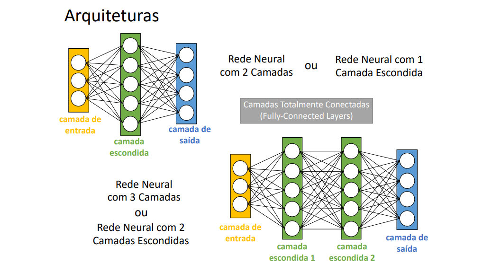
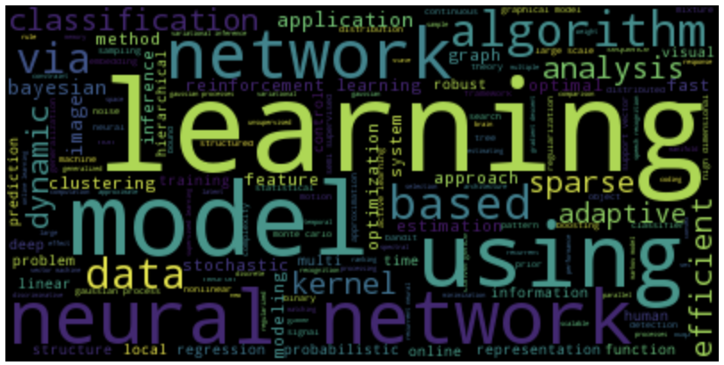
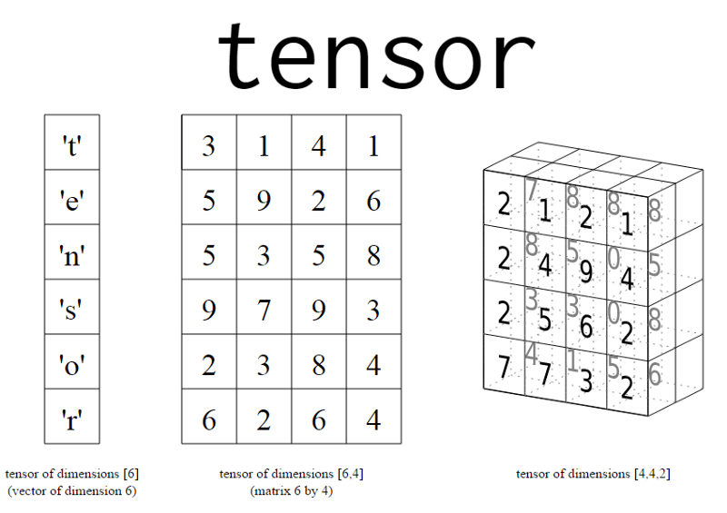
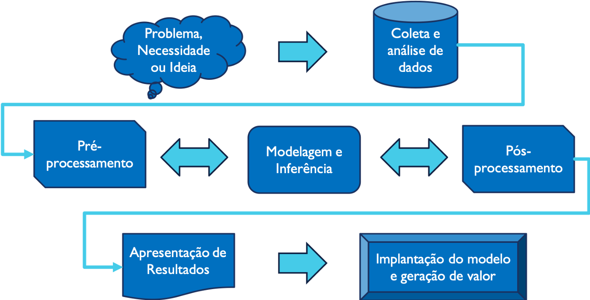
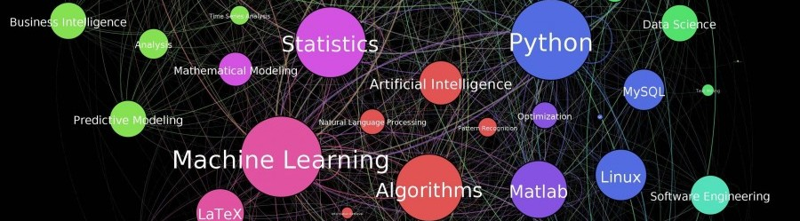
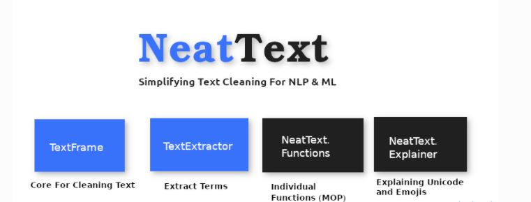
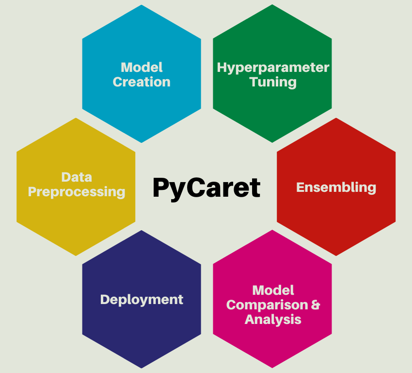

<html lang="en">
  <!-- Page Content-->
        

            <!-- About-->
            <section class="resume-section" id="about">
                

                    <h1 class="mb-0">
                        Luiz
                        Henrique
                    </h1>
                    

                        Mafra -SC · Brasil 
                    

                    <a href=" https://www.linkedin.com/in/luiz-henrique-sc">Linkedin</a>
                    <a href=" https://github.com/luiz-star?after=Y3Vyc29yOnYyOpK5MjAyMS0wNS0wN1QyMTo1MDowMy0wMzowMM4YTRe3&tab=repositories">Github</a> 
                    <a href="mailto:name@email.com">riquebue@hotmail.com</a>
                    
Olá, seja bem vindo (a)!

                    

                </section>
            

          <!-- P_R_O_J_E_T_O_S-->
            <section class="resume-section" id="P_R_O_J_E_T_O_S">
                

                    <h2 class="mb-5">P_R_O_J_E_T_O_S</h2>
                    

                        

                            <h3 class="mb-0">Projeto1 Redes_Neurais_Convolucionais</h3>
                            <a href="https://github.com/luiz-star/Redes_Neurais_convolucionais">Projeto1</a>
                            
https://github.com/luiz-star/Redes_Neurais_convolucionais

                            
                            
Uma Rede Neural Convolucional (ConvNet / Convolutional Neural Network / CNN) é um algoritmo de Aprendizado Profundo (Deep Learning) que pode captar uma imagem de entrada, atribuir importância (pesos e vieses que podem ser aprendidos) a vários aspectos / objetos da imagem e ser capaz de diferenciar um do outro. O pré-processamento exigido em uma CNN é muito menor em comparação com outros algoritmos de classificação. Enquanto nos métodos primitivos os filtros são feitos à mão, com treinamento suficiente, as CNNs têm a capacidade de aprender esses filtros / características

                        

                   

                    

                        

                            <h3 class="mb-0">Projeto2 Ebook_Machine_Learning</h3>
                            <a href="https://github.com/luiz-star/Ebook_Machine_Learning">Projeto2</a>
                            
https://github.com/luiz-star/Ebook_Machine_Learning

                            
                            
Ebook Desmistificando o Machine Learning produzido pelo comitê de Machine Learning I2AI , projeto realizado no intuito de ajudar no aprendizado de iniciantes

                        

                   
    
                    

                        

                            <h3 class="mb-0">Projeto3 PLN_Word2vec</h3>
                            <a href="https://github.com/luiz-star/PLN-Word2vec">Projeto3</a>
                            
https://github.com/luiz-star/PLN-Word2vec

                            
                            
Previsão de Palavras com Base no Contexto e Visualização com PCA
Teste do Modelo e Redução de Dimensionalidade com PCA.            

Para testar o modelo, tudo que precisamos é dos pesos, em nosso exemplo W1 e W2. Mas visualizar os dados é desafiador, pois a dimensionalidade é alta e quanto maior o número de palavras do vocabulário, mais complicado.
Uma alternativa, é reduzir a diemensionalidade dos dados. Convertemos todos os atributos em 2 componentes principais usando PCA (Principal Component Analysis) e com 2 componentes podemos visualizar os dados.

                        
     
                   

                    

                        

                            <h3 class="mb-0">Projeto4 Deep Learning_Introducao_TensorFlow</h3>
                            <a href="https://github.com/luiz-star/Intro_TensorFlow">Projeto4</a>
                            
https://github.com/luiz-star/Intro_TensorFlow

                            
                            
O Tensorflow é uma das bibliotecas mais amplamente utilizadas para implementar o aprendizado de máquina e outros algoritmos que envolvem grandes operações matemáticas. O Tensorflow foi desenvolvido pelo Google e é uma das bibliotecas de aprendizado de máquina mais populares no GitHub. O Google usa o Tensorflow para aprendizado de máquina em quase todos os aplicativos. Se você já usou o Google Photos ou o Google Voice Search, então já utlizou uma aplicação criada com a ajuda do TensorFlow. Vamos compreender os detalhes por trás do TensorFlow.

Matematicamente, um tensor é um vetor N-dimensional, significando que um tensor pode ser usado para representar conjuntos de dados N-dimensionais.

                        
     
                   

                   

                       

                           <h3 class="mb-0">Projeto5 Agrupamento_de_Clientes</h3>
                           <a href="https://github.com/luiz-star/Agrupamento_Clientes">Projeto5</a>
                           
https://github.com/luiz-star/Agrupamento_Clientes

                           
                           
 Agrupar os consumidores por similaridade a afim de compreender o comportamento dos clientes e sua relação com o consumo de energia.A partir de dados de consumo de energia de clientes, nosso trabalho é agrupar os consumidores por similaridade a afim de compreender o comportamento dos clientes e sua relação com o consumo de energia.

                        

                   

                    

                        

                            <h3 class="mb-0">Projeto6 Análise_Exploratória de Dados</h3>
                            <a href="https://github.com/luiz-star/ANALISE-EXPLORATORIA-DADOS">Projeto6</a>
                            
https://github.com/luiz-star/ANALISE-EXPLORATORIA-DADOS

                            
                            
Neste notebook usaremos uma pesquisa recente nos EUA sobre o mercado de trabalho para programadores de software. Nosso objetivo é fazer uma investigação inicial dos dados a fim de detectar problemas com os dados, necessidade de mais variáveis, falhas na organização e necessidades de transformação.
Pesquisa Salarial realizada pelo site https://www.freecodecamp.com/ com programadores de software nos EUA que frequentaram treinamentos Bootcamp.

                        

                   
    
                    

                        

                            <h3 class="mb-0">Projeto7 Diabetes_PUC_RIO</h3>
                            <a href="https://github.com/luiz-star/Diabetes_Puc_rio">Projeto7</a>
                            
https://github.com/luiz-star/Diabetes_Puc_rio

                            
                            
Pré-processamento de Dados.Especialização em Ciência de Dados - PUC-Rio. Para este experimento, vamos utilizar o dataset Pima Indians Diabetes, que é originalmente do Instituto Nacional de Diabetes e Doenças Digestivas e Renais. Seu objetivo dé prever se um paciente tem ou não diabetes, com base em certas medidas de diagnóstico médico. Este é um subconjunto de um dataset maior e aqui, todos os pacientes são mulheres com pelo menos 21 anos de idade e de herança indígena Pima.

                        

                    

                    

                        

                            <h3 class="mb-0">Projeto8 Mini_Palestra_FATEC_OURINHOS</h3>
                             <a href="https://github.com/luiz-star/Minha_Palestra_FATEC_OURINHOS">Projeto8</a>
                            
https://github.com/luiz-star/Minha_Palestra_FATEC_OURINHOS

                            
                            
Pré processamento Linguagem Natural NeatText é um pacote simples de processamento de linguagem natural para limpar dados de texto e pré-processar dados de texto. Ele pode ser usado para limpar frases, extrair e-mails, números de telefone, links da web e emojis de frases. Também pode ser usado para configurar pipelines de pré-processamento de texto.

                        

                    

                    

                        

                            <h3 class="mb-0">Projeto9 Lazzy Predict</h3>
                             <a href="https://github.com/luiz-star/Lazzy_Predict">Projeto9</a>
                            
https://github.com/luiz-star/Lazzy_Predict

                            
                            
É uma das melhores bibliotecas python que o ajuda a semi-automatizar sua tarefa de aprendizado de máquina. Ele constrói muitos modelos básicos sem muito código e ajuda a entender quais modelos funcionam melhor sem qualquer ajuste de parâmetro.                              
Suponha que temos uma declaração de problema e realmente precisamos aplicar todos os modelos naquele conjunto de dados específico e temos que analisar como está o desempenho de nosso modelo básico. Aqui, modelo básico significa “Modelo sem parâmetros”. Portanto, podemos fazer essa tarefa diretamente usando o Lazy Predict. Depois de obter toda a precisão, podemos escolher os 5 principais modelos e aplicar o ajuste de hiperparâmetros a eles. Ele fornece um Lazy Classifier para resolver o problema de classificação e Lazy Regressor para resolver o problema de regressão.

                        

                    

                    

                        

                            <h3 class="mb-0">Projeto10 Pycaret</h3>
                             <a href="https://github.com/luiz-star/PYCARET">Projeto10</a>
                            
https://github.com/luiz-star/PYCARET

                            
                            
O Pycaret executa algumas tarefas básicas de pré- processamento, como ignorar os IDs e as colunas de data, imputar os valores ausentes, codificar as variáveis categóricas e dividir o conjunto de dados na divisão de teste e treino para o restante das etapas de modelagem.
Quando você executa a função configuração, ela primeiro confirma os tipos de dados e, em seguida, se você pressionar enter, criará o ambiente para você prosseguir

                        

                    

                </section>
                

            <!-- Skills-->
            <section class="resume-section" id="skills">
                

                    <h2 class="mb-5">Skills</h2>
                    
Programming Languages & Tools

                    
Workflow

                    <ul class="fa-ul mb-0">
                        <li>
                            <i class="fas fa-check"></i>
                            Machine Learning
                        </li>
                        <li>
                            <i class="fas fa-check"></i>
                            Data analysis
                        </li>
                        <li>
                            <i class="fas fa-check"></i>
                            Data visualization
                        </li>
                        <li>
                            <i class="fas fa-check"></i>
                            Python
                        </li>
                        <li>
                            <i class="fas fa-check"></i>
                            Tableau
                        </li>
                         <li>
                            <i class="fas fa-check"></i>
                            Git
                        </li>
                         <li>
                            <i class="fas fa-check"></i>
                            PLN
                        </li>
                         <li>
                            <i class="fas fa-check"></i>
                            SQL
                        </li>
                         <li>
                            <i class="fas fa-check"></i>
                            Deep Learning
                        </li>
                         <li>
                            <i class="fas fa-check"></i>
                            Statistic
                        </li>
                         <li>
                            <i class="fas fa-check"></i>
                            Business Intelligence
                        </li>
                         <li>
                            <i class="fas fa-check"></i>
                            Computer Vision
                        </li>
                        <li>
                            <i class="fas fa-check"></i>
                            Artificial Intelligence
                        </li>
                        <li>
                            <i class="fas fa-check"></i>
                            Data Warehouse
                        </li>
                        <li>
                            <i class="fas fa-check"></i>
                            R Language
                        </li>
                        <li>
                            <i class="fas fa-check"></i>
                            Software Enginering for Data Science
                        </li>
                    </ul>
                

            </section>
            

            <!-- Interests-->
            <section class="resume-section" id="interests">
                

                    <h2 class="mb-5">Interests</h2>
                    
Sou capaz de aplicar pensamento crítico e inteligência na exploração, tratamento e manipulação, visualização e análise de dados através de algoritmos estatístico e de Machine Learning com o objetivo de encontrar padrões, realizar predições e extrair insights poderosos para resolução de problemas de negócio

                    
Possuo um perfil curioso, flexível e dinâmico e isso me permite pesquisar, aprender, filtrar informações e compartilhá-los para decisão cooperativa.Com forte capacidade comunicativa e gerencial.

                

            </section>
            

            <!-- Awards-->
            <section class="resume-section" id="awards">
                

                    <h2 class="mb-5">Awards & Certifications</h2>
                    <ul class="fa-ul mb-0">
                        <li>
                            <i class="fas fa-trophy text-warning"></i>
                            Formação Cientista de Dados
                        </li>
                        <li>
                            <i class="fas fa-trophy text-warning"></i>
                            Visualização de Dados e Design de Dashboards
                        </li>
                         <li>
                            <i class="fas fa-trophy text-warning"></i>
                            Business Analytics
                        </li>
                         <li>
                            <i class="fas fa-trophy text-warning"></i>
                            Machine Learning
                        </li>
                         <li>
                            <i class="fas fa-trophy text-warning"></i>
                            Engenharia de Dados com Hadoop e Spark
                        </li>
                         <li>
                            <i class="fas fa-trophy text-warning"></i>
                            Big Data Real Time Analytics com Python e Spark
                        </li>
                         <li>
                            <i class="fas fa-trophy text-warning"></i>
                            Certificado AI Technologies Foundation
                        </li>
                         <li>
                            <i class="fas fa-trophy text-warning"></i>
                            Big Data Analytics com R e Microsoft Azure Machine Learning
                        </li>
                         <li>
                            <i class="fas fa-trophy text-warning"></i>
                            Scrum Web Developer
                        </li>
                         <li>
                            <i class="fas fa-trophy text-warning"></i>
                            Engenharia de Dados
                        </li>
                         <li>
                            <i class="fas fa-trophy text-warning"></i>
                            Excel
                        </li>
                         <li>
                            <i class="fas fa-trophy text-warning"></i>
                            Power BI 
                        </li>
                    </ul>                             
                

            </section>
        

        <!-- Bootstrap core JS-->
        
        <!-- Core theme JS-->
        
    </body>      
</html>
        
